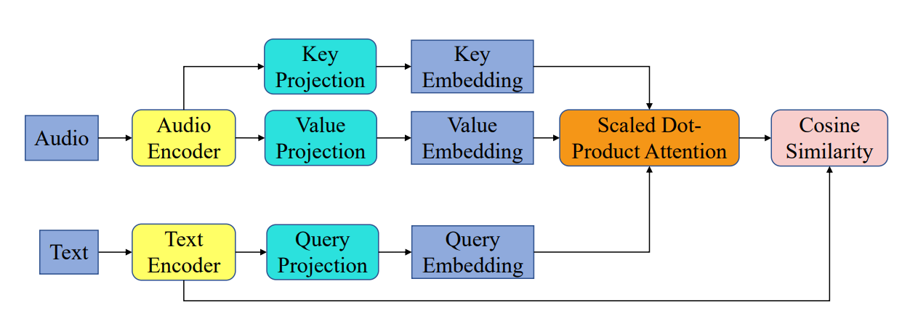

This repository builds upon [salsa](https://github.com/OptimusPrimus/salsa) [[1]](#1) repository and contains the implementation to run and reproduce the results of experiments
from my Practical Work / [Bachelor Thesis](https://github.com/timoniko/PR-Text-To-Audio-Retrieval/blob/main/main-thesis.pdf). 
The experiments focused on stage 1 training using Clotho dataset. All runs were conducted on a single NVIDIA RTX4090.


## Setting up the environment
To set up the environment, refer to the [original repo](https://github.com/OptimusPrimus/salsa) and follow 'Setting up the environment' section, 
but with the updated  ```environment.yml``` file. 
The provided environment can be set up on Linux and on Windows using WSL.

## Baseline Run

To execute the baseline, run the following command:
```
CUDA_VISIBLE_DEVICES=0 python -m experiments.ex_dcase24 with \
data_loader.batch_size=16 \
data_loader.batch_size_eval=16 \
audio_features.model=atst \
sentence_features.model=roberta-large \
rampdown_type=cosine \
max_epochs=20 \
rampdown_stop=15 \
warmup_length=1 \
rampdown_start=1 \
train_on=clothov2 \
seed=123
```
The expected performance is: 

| map@10 |  R@1  |  R@5  |  R@10  |
|:------:|:-----:|:-----:|:------:|
| 27.685 | 41.78 | 44.93 | 56.612 |


To improve performance, simply reduce the ATST leaning rate:


```
CUDA_VISIBLE_DEVICES=0 python -m experiments.ex_dcase24 with \
data_loader.batch_size=16 \
data_loader.batch_size_eval=16 \
audio_features.model=atst \
sentence_features.model=roberta-large \
rampdown_type=cosine \
max_epochs=20 \
rampdown_stop=15 \
warmup_length=1 \
rampdown_start=1 \
train_on=clothov2 \
lr_audio_encoder=4e-6
seed=327
```

The expected performance is: 

| map@10 |  R@1   |  R@5  |  R@10  |
|:------:|:------:|:-----:|:------:|
| 30.103 | 18.526 | 46.01 | 59.694 |


## Text Aware Attention Pooling
Instead of mean pooling over audio frames, it is proposed in [[2]](#2) to allow model to attend to the most relevant frames to a provided text.

<p align="center">
  
</p>

### Method description

Given a text embedding $c_t \in \mathbb{R}^{1 \times D}$ and an audio embedding $c_a \in \mathbb{R}^{t \times D}$ obtained  
from text and audio encoders, respectively. $t$ denotes the number of audio frames and $D$ is the size of the shared representation.  

$c_t$ is projected into a query $Q_t \in \mathbb{R}^{1 \times D_p}$ and $c_a$ is projected into key $K_a \in \mathbb{R}^{t \times D_p}$  
and value $V_a \in \mathbb{R}^{t \times D_p}$ matrices, where $D_p$ is the chosen projection size.  

Let $W_q$, $W_k$, and $W_v$ be learnable matrices in $\mathbb{R}^{D \times D_p}$.  
Query, key, and value matrices are then computed as:

$$
Q_t = \mathrm{LN}(c_t^\top) W_q
$$

$$
K_a = \mathrm{LN}(c_a^\top) W_k
$$

$$
V_a = \mathrm{LN}(c_a^\top) W_v
$$

where **LN** denotes a layer normalization layer.

Scaled dot-product attention is then applied from text to each relevant frame:

$$
\mathrm{Attention}(Q_t, K_a, V_a) = \mathrm{softmax}\left( \frac{Q_t K_a^{\top}}{\sqrt{D_p}} \right) V_a
$$

It is only left to embed audio to the same representation size as text $\mathbb{R}^{1 \times D}$  
by introducing a weight matrix $W_o \in \mathbb{R}^{D_p \times D}$ to compute:

$$
z_{a|t} = \mathrm{LN}\left( \mathrm{Attention}(Q_t, K_a, V_a) W_o \right)
$$

where $z_{a|t}$ is the audio embedding $a$ depending on text $t$.

### Running the experiment

To execute the experiment, run the command:

```
CUDA_VISIBLE_DEVICES=0 python -m experiments.ex_dcase24 with \
data_loader.batch_size=16 \
data_loader.batch_size_eval=16 \
audio_features.model=atst \
sentence_features.model=roberta-large \
rampdown_type=cosine \
max_epochs=20 \
rampdown_stop=15 \
warmup_length=1 \
rampdown_start=1 \
train_on=clothov2 \
seed=124 \
audio_features.aggregate=TAP \
tap_features.p_dropout_weights=0.1 \
tap_features.p_dropout_proj=0 \
tap_features.dim=2048 \
lr_tap=2e-5 \
lr_audio_encoder=4e-6
```

The expected performance is: 

| map@10 |  R@1   |  R@5   |  R@10  |
|:------:|:------:|:------:|:------:|
| 31.041 | 19.368 | 46.775 | 60.976 |

## References
- [1] P. Primus, F. Schmid, and G. Widmer, “Estimated Audio-Caption Correspondences Improve Language-Based Audio Retrieval“
<a name="1"></a>
- [2] Yifei Xin, Dongchao Yang, Yuexian Zou, “Improving Text-Audio Retrieval by Text-aware Attention Pooling and Prior Matrix Revised Loss“
<a name="2"></a>
